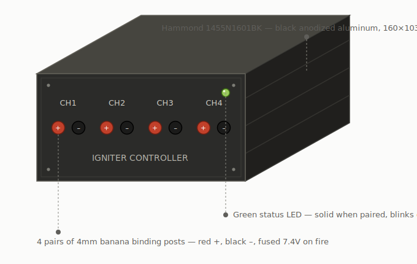

# ESP32-S3 4-Channel Remote Igniter Controller

A portable, wireless 4-channel remote igniter controller for **hobby rocketry**. Fires up to four Estes-type igniters independently over BLE from a phone. Single 2S Li-ion battery, ESP32-S3 Super Mini, in a Hammond 1455N1601BK anodized aluminum enclosure with custom SendCutSend panels.

> **Status:** Hardware design finalized (2S single-battery). Firmware in active development.




---

## Features

- 4 independently fired channels for hobby igniters
- 7.4V raw cell voltage fires Estes igniters directly (0.5-1A typical)
- BLE 5.0 control via phone (WiFi / ESP-NOW options in firmware)
- Single 2S pack: 2x Samsung 30Q 18650 + 2S BMS
- One MT3608 boost (7.4V -> 5V) for ESP32 and relay logic
- VNFOCKQSH optocoupler-isolated relay, mounted off-board
- TVS diode protection per channel; inline 5A fuse on the 7.4V rail
- 8.4V barrel-jack charging through the BMS
- Hammond aluminum enclosure with custom SendCutSend panels
- Socketed ESP32 and off-board relay — fully serviceable

---

## Quick Start

1. Order parts from the [Bill of Materials](docs/02-bom.md)
2. Review the [Schematic](docs/03-schematic.md)
3. Build following the [Assembly Guide](docs/07-assembly.md)
4. Flash firmware from the [Firmware Guide](docs/06-firmware.md)
5. Panels are pre-cut from the DXF files in [`/hardware`](hardware)

---

## Repository Structure

```
remote-controller/
├── README.md
├── LICENSE                    CERN-OHL-P (hardware) + MIT (firmware)
├── docs/
│   ├── 01-overview.md         Architecture, design decisions, specs
│   ├── 02-bom.md              Full bill of materials
│   ├── 03-schematic.md        Schematic + wiring (see images/schematic.svg)
│   ├── 04-pcb-layout.md       ElectroCookie three-zone layout
│   ├── 05-enclosure.md        Hammond enclosure + panel compatibility
│   ├── 06-firmware.md         BLE firmware, flashing, testing
│   ├── 07-assembly.md         Stage-by-stage build
│   └── images/
│       ├── schematic.svg          Block / interconnect schematic
│       ├── schematic-detail.svg   Component-level engineering schematic
│       ├── assembled.svg          Assembled three-quarter render
│       ├── parts-breakout.svg     Labelled parts breakout
│       ├── front-panel.svg        True-to-scale front panel elevation
│       └── rear-panel.svg         True-to-scale rear panel elevation
├── hardware/
│   ├── front_panel.dxf        Binding posts + LED (2D, aluminum)
│   ├── rear_panel.dxf         Charge jack + USB-C (2D, aluminum)
│   ├── front_panel.step/.stl  3D-print solid (Fusion / slicer)
│   ├── rear_panel.step/.stl   3D-print solid (Fusion / slicer)
│   └── generate_panels.py     Parametric source (CadQuery → STEP/STL)
└── firmware/
    └── remote_controller/
        └── remote_controller.ino
```

---

## Architecture at a Glance

```
[2S Pack 7.4V] -> [BMS] -+-> [5A fuse] -> relay COM x4 -> NO -> [TVS] -> posts -> igniters
                         |
                         +-> [MT3608 5V] -> ESP32-S3 + relay logic
                                                |
                                          BLE <- phone
```

---

## Drawings & Renders

| Drawing | Description |
|---------|-------------|
| [Assembled render](docs/images/assembled.svg) | Three-quarter view of the finished controller |
| [Parts breakout](docs/images/parts-breakout.svg) | Every component, grouped by function |
| [Component schematic](docs/images/schematic-detail.svg) | Net-level schematic for build / debug |
| [Front panel](docs/images/front-panel.svg) · [Rear panel](docs/images/rear-panel.svg) | True-to-scale elevations generated from the `/hardware` DXFs |

---

## License

Hardware & docs: **CERN-OHL-P v2**. Firmware: **MIT**. See [LICENSE](LICENSE).

---

## Contributing

Issues and PRs welcome. If you build one, share photos — open an issue tagged `build-log`.

---

## Safety

This device fires pyrotechnic igniters. Relays default open at power-up; the firmware fires momentary pulses only. Follow NAR/Tripoli safety guidelines and maintain safe distance.

---

## Acknowledgements

Designed with assistance from Claude (Anthropic).
