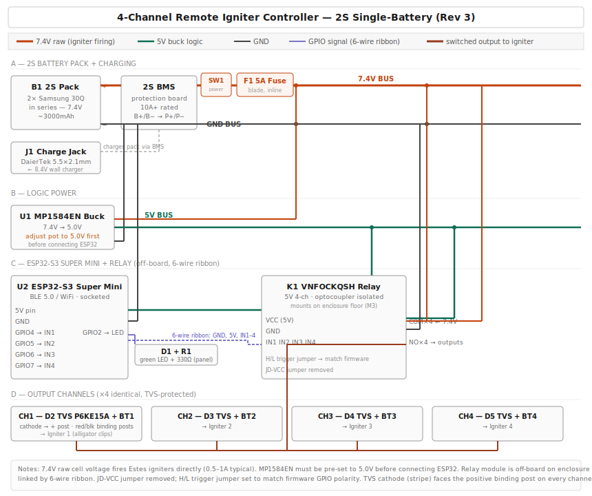
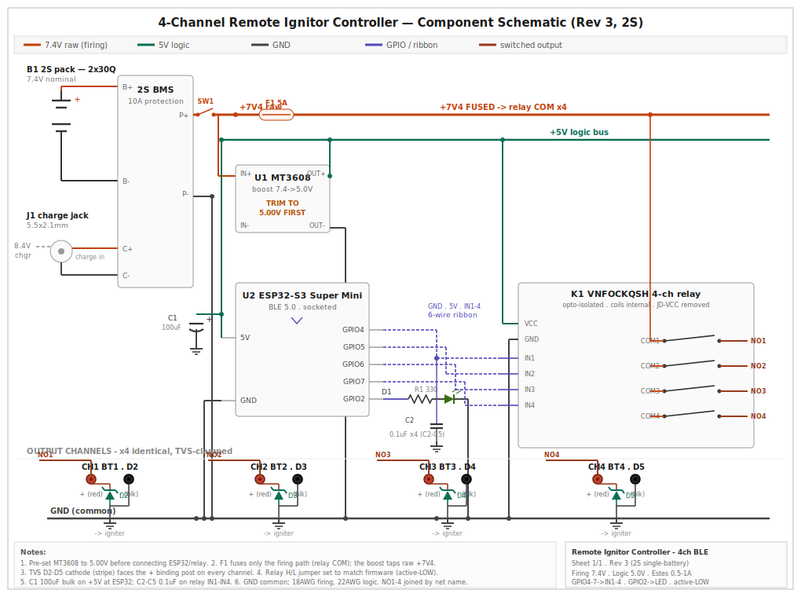

# 03 — Schematic



The block-level schematic above (`docs/images/schematic.svg`) documents interconnection between the modules.

For a net-level view an electronics engineer can build and debug from — proper symbols, pin names, power rails, decoupling, per-channel TVS and binding posts — see the component schematic:



---

## Power Architecture

A single 2S pack feeds two paths:

```
[2S Pack: 2x Samsung 30Q in series, 7.4V]
        |
   [2S BMS] <--- 8.4V charger (DaierTek barrel jack J1)
        |
   [SW1 master power]  --lamp--> GND   (illuminated rocker, rear panel)
        |
   [F1 5A inline fuse]
        |
   7.4V BUS ----+---------------------------+
        |       |                           |
        |   relay COM x4              [MP1584EN U1]
        |                             7.4V -> 5.0V
        |                                   |
        |                              5V BUS
        |                                   |
        |                          +--------+--------+
        |                       [ESP32-S3]      [Relay VCC]
        v
   relay NO x4 --> [TVS D2-D5] --> [Binding posts] --> igniters
```

GND is common across the whole system. **SW1 sits between the BMS and the
7.4V bus**, so when it's off the ESP32, the buck, and the firing rail (relay
COM and the binding posts) are all de-energized. The charger feeds the BMS
*upstream* of SW1, so the pack still charges with the device switched off.

---

## Designators

| Ref | Component |
|-----|-----------|
| B1 | 2S pack — 2x Samsung 30Q 18650 in series (7.4V) |
| — | 2S Li-ion BMS protection board |
| J1 | DaierTek 5.5x2.1mm barrel jack (charge port) |
| SW1 | Master power rocker switch (illuminated, ∅12mm panel-mount) |
| F1 | 5A blade fuse + inline holder (internal) |
| U1 | MP1584EN buck converter (7.4V -> 5.0V) |
| U2 | ESP32-S3 Super Mini |
| K1 | VNFOCKQSH 4-channel relay module (off-board) |
| D1 | 5mm green LED (status) |
| R1 | 330Ω ¼W resistor |
| D2-D5 | P6KE15A TVS diodes (one per channel) |
| C1 | 100µF 25V electrolytic (5V decoupling) |
| C2-C5 | 0.1µF ceramic (relay IN decoupling) |
| BT1-BT4 | 4mm banana binding post pairs |

---

## GPIO Assignments

| GPIO | Function |
|------|----------|
| GPIO4 | Relay IN1 (Channel 1) |
| GPIO5 | Relay IN2 (Channel 2) |
| GPIO6 | Relay IN3 (Channel 3) |
| GPIO7 | Relay IN4 (Channel 4) |
| GPIO2 | Status LED (via R1) |

---

## Relay Connection (6-wire ribbon)

The relay module mounts off-board on the enclosure floor. A 6-conductor ribbon connects it to screw terminals on the PCB:

| Ribbon wire | From (PCB) | To (relay) |
|-------------|-----------|-----------|
| 1 | GND bus | GND |
| 2 | 5V bus | VCC |
| 3 | GPIO4 | IN1 |
| 4 | GPIO5 | IN2 |
| 5 | GPIO6 | IN3 |
| 6 | GPIO7 | IN4 |

Relay COM terminals connect to the fused 7.4V bus. Relay NO terminals go to the TVS diodes and binding posts.

---

## Critical Notes

### MP1584EN pre-adjustment
Before connecting the ESP32 or relay, power the MP1584EN from the pack and adjust its trimmer pot until the output reads **5.00V ± 0.05V**. The pot is sensitive — use a small flat screwdriver and turn slowly. Over-voltage damages the ESP32-S3.

### Relay jumpers
- **JD-VCC jumper: removed.** The optocouplers already isolate the ESP32 GPIOs; output isolation is handled by the relay contacts.
- **H/L trigger jumper: set to match firmware.** The VNFOCKQSH has a selectable high/low trigger. Set it to match the firmware's `RELAY_ACTIVE_LOW` setting (default active-LOW).

### TVS orientation
P6KE15A is unidirectional. The **cathode (stripe end)** faces the positive binding post. Reversed orientation shorts the output.

### Master switch (SW1) & lamp
SW1 carries the full battery+ current (logic plus firing — a few amps peak), so use a switch rated comfortably above that; the linked rocker is rated well beyond. Wire the two contact leads in series with battery+ (BMS out → SW1 → F1). The two lamp leads are a separate illuminated indicator: lamp+ to the switched 7.4V (downstream of SW1), lamp− to GND, so it glows when the device is on. **If the lamp is rated 12V it will be dim or dark at 7.4V** — the switching itself is unaffected; for a bright indicator either source the lamp from a 12V supply or rely on the front status LED.

### Wire gauge
- 18 AWG for all 7.4V power (battery, switch, fuse, COM, output)
- 22 AWG for 5V logic and GPIO ribbon

---

## Why 7.4V Is Enough

Estes igniters fire at 0.5-1A. At 7.4V through a low-resistance bridgewire, the available current far exceeds the firing threshold. There is no benefit to a higher switching voltage for this load, which is what allowed the design to collapse from two batteries to one.
