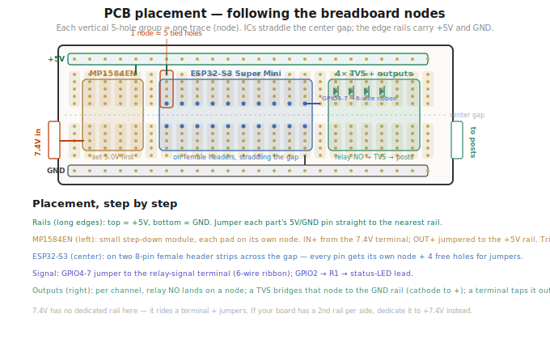

# 04 — PCB Layout

The build uses a **black ElectroCookie solderable breadboard**. The medium (~80×60mm, 30-column) board is enough — the layout below uses only ~22 of its 30 columns — but a larger ElectroCookie also fits the enclosure if you want more elbow room. The relay module mounts **off-board** on the enclosure floor, so the PCB only carries the ESP32, boost, decoupling, the TVS/output section, and the screw terminals.



---

## Work with the copper, not against it

The ElectroCookie is a 1:1 breadboard replica, so component placement follows breadboard rules — it is **not** free-form:

- **Node strips:** the main field is two banks split by a **center gap**. Each vertical group of **5 holes is one electrical node** (one trace). Adjacent groups are isolated.
- **Power rails:** continuous bus strips run along the two **long edges**. Dedicate one rail to **+5V** and the other to **GND**. (If your board has a second rail per side, give the spare to **+7.4V** and skip the jumper below.)

The consequence: parts with two rows of pins (the ESP32-S3, and most MT3608 modules) **straddle the center gap**, so each pin lands on its own 5-hole node with four free holes for jumpers — exactly like seating a DIP on a breadboard.

---

## Placement

### Power rails (long edges)
- Top edge → **+5V** bus. Bottom edge → **GND** bus.
- Jumper each part's 5V and GND pins straight to the nearest rail.
- **7.4V** has no dedicated rail on a 2-rail board: bring it in on a screw terminal and jumper it to the MT3608 input and the relay-COM feed. (Or use a 3rd/4th rail if your board has one.)

### MT3608 boost — input end, straddling the gap
- Each pad on its own node. **IN+** from the 7.4V terminal, **IN−/OUT−** to the GND rail, **OUT+** jumpered to the +5V rail.
- **Mount and trim to 5.00V before anything else is connected.** The pot is sensitive.

### ESP32-S3 Super Mini — center, straddling the gap
- On two rows of **8-pin female 2.54mm headers** (the Super Mini is narrow). Socketed so it lifts out.
- 5V pin → +5V rail; GND → GND rail.
- **GPIO4–7** jumper to the relay-signal screw terminal (the 6-wire ribbon). **GPIO2 → R1 →** a ~15cm flying lead to the panel status LED.

### TVS + outputs — output end
- Per channel: the **relay NO** wire lands on a node; a **TVS diode (D2–D5)** bridges that node to the **GND rail**, cathode (stripe) toward the **+** output; an output screw terminal taps the same node out to the binding post **+**. Each post **−** returns to the GND rail.

### Decoupling
- **C1** (100µF) across +5V↔GND near the ESP32. **C2–C5** (0.1µF) at the relay IN terminals.

---

## Wire gauge

| Run | Gauge |
|-----|-------|
| 7.4V firing path (battery, fuse, SW1, relay COM, NO → posts) | **18 AWG** |
| 6-wire ribbon to the relay (GND, 5V, IN1–IN4) | 18–22 AWG (logic/signal only, <0.4A) |
| 5V / GPIO logic, status-LED lead | 22–26 AWG |

Keep the 7.4V runs on one side of the board and 5V/signal on the other where you can, for noise isolation.

---

## Internal mounting

```
Hammond 1455N1601BK floor (single layer, ~20mm-tall parts, ~25mm headroom):
  - ElectroCookie PCB on M3 standoffs (front)
  - VNFOCKQSH relay module bolted flat to the floor, M3 (rear)
  - 2S 18650 pack lying down, hook-and-loop strap
  - 2S BMS + inline 5A fuse tucked beside the battery
  - SW1, barrel jack, USB-C on the rear panel; binding posts + LED on the front
```

See [07-assembly.md](07-assembly.md) for the top-down layout and side-view height drawings. The off-board relay and single battery leave plenty of room; the 6-wire ribbon has enough slack to lift the PCB out without unplugging the relay.
