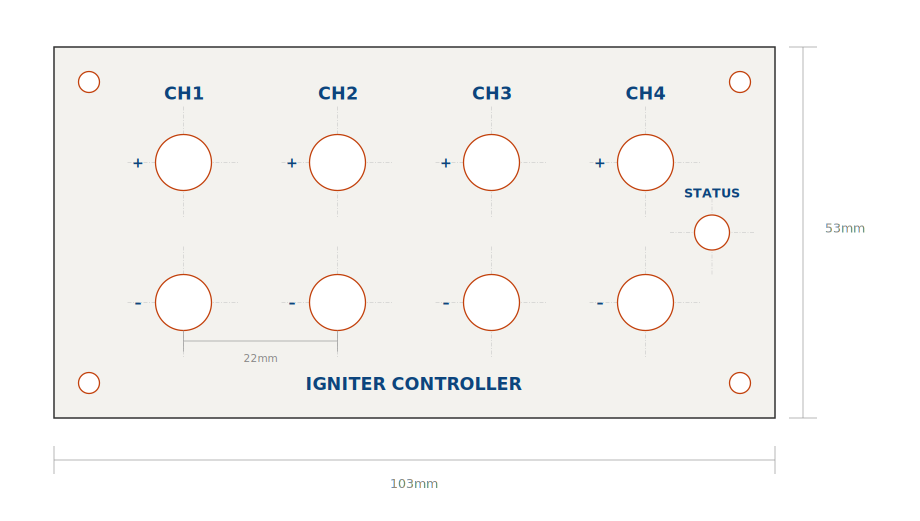
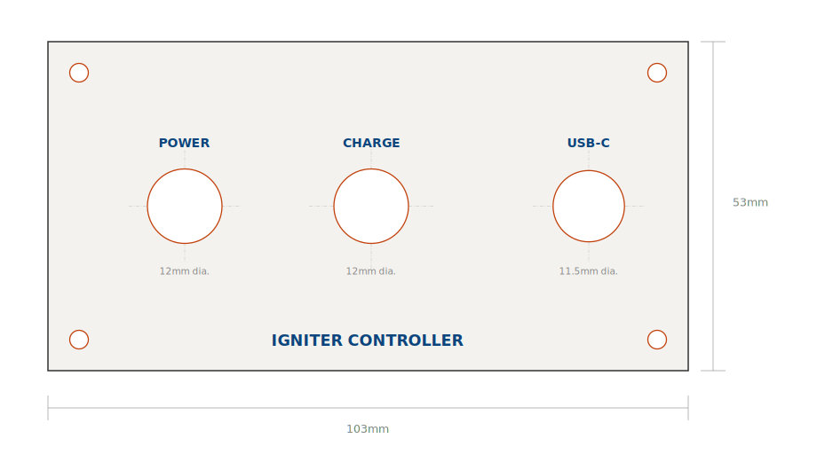

# 05 — Enclosure

## Hammond 1455N1601BK

**External:** 160mm L x 103mm W x 53mm H
**Internal usable depth:** ~45mm
**Material:** Extruded aluminum, black anodized, IP54
**End panels:** Removable aluminum, 103 x 53mm each

Front and rear panels were custom-cut by **SendCutSend** from the DXF files in `/hardware`. Both panels are confirmed compatible with the 2S single-battery design.

---

## Panel Compatibility (2S design)

When the design consolidated to a single 2S battery with barrel-jack charging, the existing panels were re-checked against the new layout. Conclusion: **both panels are usable as-is.**

| Panel feature | Size | Use in 2S design |
|---------------|------|------------------|
| Front: 8x ∅8mm holes (4 pairs) | 8mm | Channel binding posts — unchanged |
| Front: ∅5mm hole (top-right) | 5mm | Status LED — unchanged |
| Rear: ∅12mm round hole | 12mm | DaierTek barrel jack — correct size |
| Rear: 20x13mm slot | 20x13mm | Panel-mount blade fuse holder |
| Rear: 9x3.5mm slot | 9x3.5mm | USB-C — kept open for firmware flashing / serial |
| Both: 4x ∅3mm corner holes | 3mm | M3 panel mounting |

> The rear USB-C cutout is intentionally kept open even though USB is no longer used for power. It preserves wired firmware flashing and serial debug access to the ESP32-S3 Super Mini.

---

## Panel Elevations

These elevations are generated directly from the `/hardware` DXF coordinates, so they are true to scale (1:1 in mm). `CUT` features are red, `ENGRAVE` labels blue, dimensions gray.

**Front panel** — 4 binding-post pairs (CH1–CH4), status LED, 4× M3 corner holes:

**Rear panel** — fuse slot, charge jack, USB-C cutout, 4× M3 corner holes:

---

## Front Panel Hole Positions (Y = 26.5mm center)

| Feature | Hole | X position |
|---------|------|-----------|
| CH1 + / - | ∅8mm | 10.5 / 20.5mm |
| CH2 + / - | ∅8mm | 34.5 / 44.5mm |
| CH3 + / - | ∅8mm | 58.5 / 68.5mm |
| CH4 + / - | ∅8mm | 82.5 / 92.5mm |
| Status LED | ∅5mm | 94.0mm (Y=43mm) |

Post spacing within a pair: 10mm. Gap between channels: 14mm.

## Rear Panel Hole Positions (Y = 26.5mm center)

| Feature | Hole | X position |
|---------|------|-----------|
| Fuse holder | 20x13mm slot | 22mm |
| Charge jack J1 | ∅12mm | 52mm |
| USB-C (flashing) | 9x3.5mm slot | 87mm |

---

## DXF Files

`/hardware/front_panel.dxf` and `/hardware/rear_panel.dxf` contain four layers:
- `CUT` (red) — holes and slots
- `ENGRAVE` (blue) — labels
- `OUTLINE` (black) — panel boundary, reference only
- `DIMENSION` (gray) — measurements, reference only

These import directly into SendCutSend, Front Panel Express, or any CAD/CAM tool.

---

## Panel Labeling

For now a label maker works fine. For a professional finish, the DXF `ENGRAVE` layer can be sent to SendCutSend (engraving) or Front Panel Express for laser-engraved, anodized labels.

Suggested labels: CH1-CH4 above each binding post pair, "CHARGE" by the barrel jack, "FUSE 5A" by the fuse holder, polarity + / - marks per post.

---

## Internal Mounting

- **PCB:** M3 standoffs to the floor, or slide into the enclosure's internal rails
- **Relay module:** bolted flat to the floor via M3 through its corner holes
- **2S pack:** hook-and-loop strap to the floor so it can't shift
- **Fuse holder + barrel jack:** panel-mounted on the rear, wired with enough slack to swing the panel open ~45 deg for servicing
