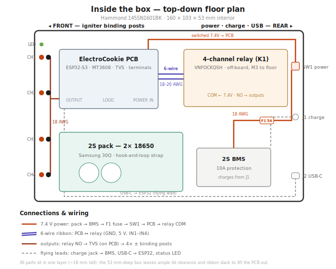
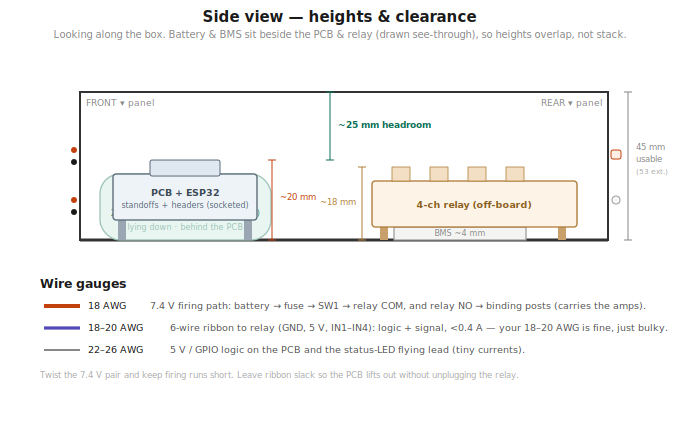

# 07 — Assembly Guide

Build in stages. Test each before moving on.

---

## Internal Layout

Where everything goes inside the Hammond enclosure — board placement, the 2S pack, the 6-wire ribbon, connectors, and wire gauges:

Heights and lid clearance (everything sits in one layer):

For component placement *on the PCB itself* (breadboard nodes, rails, where the ESP32/MP1584EN/TVS sit), see [04-pcb-layout.md](04-pcb-layout.md).

---

## Stage 1 — Battery Pack & BMS

1. Assemble the 2S pack: 2x Samsung 30Q in series in the holder (or series-wire two single holders)
2. Wire the pack to the 2S BMS: B+ / B- and the mid-point tap per the BMS markings
3. The BMS P+ / P- are the protected output (7.4V)
4. Verify pack voltage at P+ / P- with a multimeter — should read ~7.4-8.4V depending on charge

**Test:** ~7.4V present at BMS output, no heat, no spark on connection.

---

## Stage 2 — Charging Check

1. Wire the DaierTek barrel jack to the BMS charge input
2. Plug in the 8.4V charger
3. Confirm the pack charges (BMS LED or rising voltage toward 8.4V)

**Test:** Pack charges to 8.4V and the charger tapers off.

---

## Stage 3 — MP1584EN to 5.0V

1. Wire BMS output (7.4V) to MP1584EN IN+ / IN-
2. Power the MP1584EN, measure OUT+ / OUT-
3. **Adjust the trimmer pot until output reads 5.00V ± 0.05V.** Turn slowly.

**Test:** Stable 5.00V at MP1584EN output. Nothing downstream connected yet.

---

## Stage 4 — ESP32-S3 First Boot

1. Solder two 8-pin female header rows straddling the ElectroCookie center gap; plug in the ESP32-S3
2. Wire MP1584EN 5V -> +5V edge rail, GND -> GND edge rail
3. Flash a blink sketch over USB-C to confirm the toolchain
4. Flash the main firmware from `/firmware/remote_controller/`
5. Confirm `RemoteBox` appears in a BLE scan (nRF Connect)

**Test:** Phone sees `RemoteBox` over BLE.

---

## Stage 5 — Relay (off-board) Logic Test

1. Bolt the VNFOCKQSH relay to the enclosure floor (M3)
2. Confirm the JD-VCC jumper is removed and the H/L trigger jumper matches firmware (default active-LOW)
3. Run the 6-wire ribbon: GND, 5V, IN1->GPIO4, IN2->GPIO5, IN3->GPIO6, IN4->GPIO7
4. Power logic only (no 7.4V to COM yet)
5. From nRF Connect, write "1"-"4"

**Test:** Each relay clicks on the matching command; relay LEDs light.

---

## Stage 6 — Master Switch, Fuse & Firing Power

1. Wire **SW1** (rear-panel master switch) in the battery+ line: BMS P+ → SW1 → inline 5A fuse
2. Fused, switched 7.4V -> relay COM x4 (parallel to the bus)
3. Lamp leads of SW1: to the switched 7.4V and GND (illuminated rocker; dim at 7.4V if it's a 12V lamp)
4. Measure: 7.4V at COM with SW1 on, **0V at COM with SW1 off**, 5V rail unchanged

**Test:** Switch cuts COM power; both rails present when on, no interference.

---

## Stage 7 — Output Channels

For each channel:
1. TVS diode (D2-D5) across the output — cathode stripe to + post
2. Relay NO -> binding post + (red)
3. GND -> binding post - (black)

**Test:** With a relay fired, ~7.4V across the binding posts; 0V idle.

---

## Stage 8 — LED, Caps, Enclosure

1. C1 (100µF) across the 5V rail near the ESP32
2. C2-C5 (0.1µF) at each relay IN line
3. R1 + D1 LED on GPIO2 out to the front panel (15cm lead)
4. Mount binding posts, LED, SW1, USB-C receptacle, barrel jack to panels
5. Secure PCB, relay, 2S pack, and the inline fuse holder inside
6. Dress wiring, close panels

**Final test:**
- BLE connects
- All 4 channels fire and show 7.4V at the posts
- LED solid when connected, blinks on fire
- No abnormal heat after a few minutes

---

## Safety Checklist (igniters)

- [ ] 5A fuse installed; SW1 cuts COM power when off
- [ ] JD-VCC jumper removed; H/L trigger matches firmware
- [ ] MP1584EN verified at 5.00V
- [ ] TVS cathode to + post on every channel
- [ ] Relays confirmed open (safe) at power-up
- [ ] All terminals tug-tested
- [ ] No bare conductors near the aluminum enclosure
- [ ] Igniters connected last, system kept unpowered until ready to fire
- [ ] Safe distance per NAR/Tripoli guidelines
